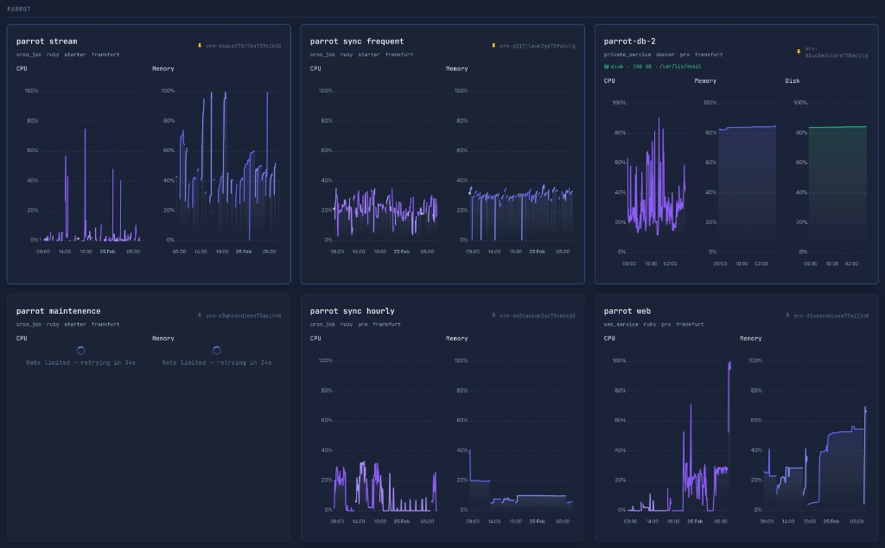

# RenderDashboard

A Ruby gem providing a [Render.com](https://render.com) API client, mountable Rails metrics dashboard, and monitoring rake tasks.



## Requirements

- Ruby >= 3.0
- Rails >= 6.0 (for the engine and rake tasks)
- [Tailwind CSS](https://tailwindcss.com/) in the host app (the dashboard views use Tailwind utility classes)

## Installation

Add to your Gemfile:

```ruby
gem "render-dashboard", path: "/path/to/render-dashboard"
# or
gem "render-dashboard", github: "your-org/render-dashboard", branch: "main"
```

Then run `bundle install`.

## Configuration

Create an initializer (e.g. `config/initializers/render-dashboard.rb`):

```ruby
RenderDashboard.configure do |config|
  config.api_key = ENV["RENDER_API_KEY"]
end
```

If omitted, the API key defaults to `ENV["RENDER_API_KEY"]`.

## Dashboard

### Mounting

In your `config/routes.rb`:

```ruby
mount RenderDashboard::Engine, at: "/render"
```

The metrics dashboard is then available at `/render/metrics`.

### Features

- CPU and memory charts for every Render service on your account
- Automatic percentage conversion when limit data is available
- Time range picker (1 h, 6 h, 24 h, 7 d) with adaptive resolution
- Dark mode support (follows the host app's `dark` class on `<html>`)
- Charts rendered with [ApexCharts](https://apexcharts.com/) (loaded via CDN)

## API Client

Use the client directly for custom integrations:

```ruby
client = RenderDashboard::Client.new

# List all services
client.services

# Get CPU metrics for a service
client.cpu(resource: "srv-xxxxx")

# Get memory metrics with a custom time range
client.memory(
  resource: "srv-xxxxx",
  start_time: 6.hours.ago,
  end_time: Time.current,
  resolution: 300
)
```

You can also pass an explicit API key:

```ruby
client = RenderDashboard::Client.new(api_key: "rnd_...")
```

### Available Metric Methods

All metric methods accept: `resource:`, `start_time:`, `end_time:`, `resolution:`, `instance:`, `aggregation:`.

| Method               | Render Endpoint              |
| -------------------- | ---------------------------- |
| `cpu`                | `/metrics/cpu`               |
| `cpu_limit`          | `/metrics/cpu-limit`         |
| `cpu_target`         | `/metrics/cpu-target`        |
| `memory`             | `/metrics/memory`            |
| `memory_limit`       | `/metrics/memory-limit`      |
| `memory_target`      | `/metrics/memory-target`     |
| `disk_usage`         | `/metrics/disk-usage`        |
| `disk_capacity`      | `/metrics/disk-capacity`     |
| `bandwidth`          | `/metrics/bandwidth`         |
| `bandwidth_sources`  | `/metrics/bandwidth-sources` |
| `http_requests`      | `/metrics/http-requests`     |
| `http_latency`       | `/metrics/http-latency`      |
| `active_connections` | `/metrics/active-connections`|
| `instance_count`     | `/metrics/instance-count`    |
| `replication_lag`    | `/metrics/replication-lag`   |

### Service Methods

| Method              | Description             |
| ------------------- | ----------------------- |
| `services(limit:)`  | List all services       |
| `service(id)`       | Get a single service    |
| `disk(id)`          | Get a persistent disk   |

### Disk usage helper

```ruby
usage = RenderDashboard::DiskUsage.fetch("srv-xxxxx")
usage.used_percent   # => 85.8
usage.used_gb        # => 253.0
usage.total_gb       # => 294.79
usage.summary        # => "85.8% (253.0 GB / 294.79 GB) on prophecy db (Render metrics API)"
```

Uses `/metrics/disk-usage` and `/metrics/disk-capacity` — works from any host with API credentials (no disk mount required).

## Rake Tasks

Available when the gem is loaded in a Rails app.

### `render-dashboard:info`

Prints service and disk info, including live usage from the Render metrics API:

```bash
rake render-dashboard:info
```

To inspect a single service:

```bash
RENDER_SERVICE_ID=srv-xxxxx rake render-dashboard:info
```

### `render-dashboard:disk_check`

Checks disk usage via the Render metrics API and writes an urgent log when the threshold is exceeded.

```bash
rake render-dashboard:disk_check
```

| Environment Variable               | Description                            | Default      |
| ---------------------------------- | -------------------------------------- | ------------ |
| `RENDER_API_KEY`                   | Render API key                         | —            |
| `RENDER_SERVICE_ID`                | Service to check                       | —            |
| `RENDER_SERVICE_NAME`              | Label when API lookup fails            | `"database"` |
| `RENDER_DISK_PERCENT_USE_WARNING`  | Usage percentage that triggers urgent logging | `80`         |
| `DISK_ALERT_THRESHOLD`             | Alias for the warning threshold        | `80`         |

When the threshold is exceeded the task only writes to the configured urgent logger. It does not deliver email, WhatsApp, push notifications, or other external alerts.

## Development

After cloning, install git hooks:

```bash
rake setup
```

This enables pre-commit checks that run automatically on `git commit`:

- **Ruby syntax** — `ruby -c` on all staged `.rb` files
- **ERB syntax** — validates staged `.erb` templates
- **Frozen string literal** — warns if the pragma is missing from `.rb` files
- **Trailing whitespace** — catches whitespace errors in staged files
- **Gemspec validity** — validates the gemspec when it's staged
- **Debug statements** — blocks `binding.pry`, `binding.irb`, `byebug`, `debugger`

To bypass in an emergency: `git commit --no-verify`

## License

This gem is available as open source under the terms of the [MIT License](https://opensource.org/licenses/MIT).
